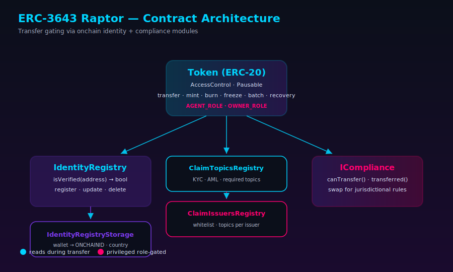

<div align="center">



# ERC-3643 Raptor

**An educational, gas-optimized reference implementation of the [ERC-3643 (T-REX) Permissioned Token Standard](https://eips.ethereum.org/EIPS/eip-3643), the token standard used for onchain securities and Real World Asset (RWA) tokenization on Ethereum.**

[](https://github.com/Aboudjem/ERC-3643/actions/workflows/ci.yml)
[](./LICENSE.md)
[](https://docs.soliditylang.org/en/v0.8.17/)
[](https://hardhat.org/)
[](https://docs.openzeppelin.com/contracts/)
[](https://eips.ethereum.org/EIPS/eip-3643)
[](./AGENTS.md)
[](./CONTRIBUTING.md)

> **Not audited. Not for production.** For mainnet security token deployments, use [Tokeny's T-REX](https://github.com/TokenySolutions/T-REX). Raptor is for learning, forking, and prototyping.

</div>

---

## What is ERC-3643?

**ERC-3643** (also called **T-REX**, short for Token for Regulated EXchanges) is an Ethereum token standard for regulated securities and Real World Assets (RWA). It extends ERC-20 with onchain identity verification, programmable transfer compliance, and agent-controlled freeze and recovery.

[Tokeny Solutions](https://github.com/TokenySolutions/T-REX) wrote the original implementation and the spec was ratified as [EIP-3643](https://eips.ethereum.org/EIPS/eip-3643). It's now the dominant standard for compliant security token issuance on Ethereum and most EVM chains.

Plain ERC-20 can't verify who holds a token. ERC-3643 fixes that. Every transfer runs two onchain checks: the recipient must be linked to a verified [ONCHAINID](https://github.com/onchain-id/solidity) carrying valid KYC/AML claims, and the transfer must satisfy the issuer's compliance rules (country caps, investor caps, transfer windows, and so on).

**Raptor** is my simplified take on this standard. I contributed to the original T-REX codebase at Tokeny, and Raptor is how I hand the same ideas to developers entering the RWA space. The goal is modest: read it in one sitting, run it in one evening.

## Why ERC-3643 Matters for RWA Tokenization

Tokenized Treasuries, tokenized bonds, tokenized private equity, tokenized real estate: every RWA category eventually needs the same thing, a token that only verified and compliant investors can hold. ERC-3643 is the standard that solves it.

What it adds on top of ERC-20:

- **Onchain identity gating.** Every holder needs a verified [ONCHAINID](https://github.com/onchain-id/solidity) with claims (KYC, AML, accreditation, jurisdiction) signed by authorized issuers. No ONCHAINID, no transfer.
- **Compliance at the contract level.** Transfers are rejected if they violate programmable rules: country caps, maximum holder counts, lockup windows, whitelists, accreditation checks.
- **Agent controls for issuers.** Agents can freeze wallets, freeze partial balances, force transfers, recover lost wallets, and pause the token entirely.
- **Full ERC-20 compatibility.** Wallets, DEXs, and indexers treat it like any ERC-20. The extra checks only fire on writes.

## What Is Raptor?

**Raptor = Regulated Asset Platform for Tokenized Operations & Resources.**

Raptor is an educational, gas-optimized ERC-3643 implementation written in Solidity 0.8.17. It covers the full ERC-3643 core: `Token`, `IdentityRegistry`, `IdentityRegistryStorage`, `ClaimTopicsRegistry`, `ClaimIssuersRegistry`, and `BasicCompliance`.

Design choices vs. the Tokeny reference:

- Uses OpenZeppelin `AccessControl` instead of custom `AgentRole` / `OwnerRoles`.
- Uses OpenZeppelin `Pausable` instead of a custom pause contract.
- Extended batch API: `batchTransferFrom`, `batchBurn`, `batchFreezePartialTokens`, and friends.
- Metadata (name, symbol, decimals) is immutable at deploy time, matching standard ERC-20 behavior.
- Deliberately non-upgradeable. Proxies add moving parts that obscure how the standard actually works.

What Raptor leaves out on purpose: upgradeable proxies, DVD (Delivery-vs-Delivery) atomic settlement, and modular compliance. All of that belongs in production. See the [comparison table](#differences-vs-production-t-rex) for the full diff.

## Table of Contents

- [What is ERC-3643?](#what-is-erc-3643)
- [Why ERC-3643 matters for RWA tokenization](#why-erc-3643-matters-for-rwa-tokenization)
- [What is Raptor?](#what-is-raptor)
- [Features](#features)
- [Architecture](#architecture)
- [How a transfer works](#how-a-transfer-works)
- [Quick start](#quick-start)
- [Deployment](#deployment)
- [Testing & coverage](#testing--coverage)
- [Contract API](#contract-api)
- [Differences vs. production T-REX](#differences-vs-production-t-rex)
- [Building a custom compliance module](#building-a-custom-compliance-module)
- [AI-ready: agents, Claude, Cursor, Copilot](#ai-ready-agents-claude-cursor-copilot)
- [Security](#security)
- [Contributing](#contributing)
- [Roadmap](#roadmap)
- [Keywords (SEO/GEO)](#keywords-seogeo)
- [Credits](#credits)
- [License](#license)

## Features

- **Full ERC-3643 core** — `Token`, `IdentityRegistry`, `IdentityRegistryStorage`, `ClaimTopicsRegistry`, `ClaimIssuersRegistry`, `BasicCompliance`.
- **Gas-optimized** — `unchecked` loop counters, precomputed role hashes, inline returns, consolidated checks.
- **OpenZeppelin `AccessControl`** instead of custom `AgentRole` / `OwnerRoles`.
- **OpenZeppelin `Pausable`** replaces the custom pause mechanism.
- **Extended batch API** — `batchTransfer`, `batchTransferFrom`, `batchForcedTransfer`, `batchMint`, `batchBurn`, `batchSetAddressFrozen`, `batchFreezePartialTokens`, `batchUnfreezePartialTokens`.
- **Comprehensive test suite** — Hardhat + Mocha + Chai with composable fixtures.
- **CI hardened** — Slither static analysis, CodeQL, Gitleaks secret scan, Dependabot, multi-version Node matrix.
- **AI-ready** — [`AGENTS.md`](./AGENTS.md), [`CLAUDE.md`](./CLAUDE.md), `.cursorrules`, Copilot instructions, [`docs/llms.txt`](./docs/llms.txt).

## Architecture

<div align="center">

</div>

The system has five core contracts. `Token` is the ERC-20 entry point. Before every user transfer, it calls `IdentityRegistry.isVerified(to)` and `Compliance.canTransfer(from, to, amount)`. The identity check walks the claim graph: `IdentityRegistryStorage` provides the wallet-to-ONCHAINID binding, `ClaimTopicsRegistry` says which claim types are required, and `ClaimIssuersRegistry` says which issuers are trusted to sign those claims.

For the complete role matrix and contract-level breakdown, see [`docs/ARCHITECTURE.md`](./docs/ARCHITECTURE.md).

## How a Transfer Works

Every user-initiated transfer in an ERC-3643 token follows this exact sequence:

```
1. Token.transfer(to, amount) called
2. require: token not paused
3. require: sender wallet not frozen
4. require: recipient wallet not frozen
5. require: sender free balance (balance - frozenAmount) >= amount
6. IdentityRegistry.isVerified(to)  <-- KYC/AML claim check
7. Compliance.canTransfer(from, to, amount)  <-- programmable rule check
8. Update balances, emit Transfer event
9. Compliance.transferred(from, to, amount)  <-- post-hook for accounting
```

Steps 6 and 7 are what separate ERC-3643 from plain ERC-20. Step 6 enforces investor verification through ONCHAINID. Step 7 gives the compliance module a place to track state (counting holders per country to enforce a Reg D cap, for example).

Agent-controlled operations (`forcedTransfer`, `mint`, `burn`, `recoveryAddress`) skip the pause check but still respect the frozen-balance invariant. See [`SECURITY.md`](./SECURITY.md) for the full threat model.

## Quick Start

Requirements: Node 18+ (20 LTS recommended), npm 10+, git.

```bash
git clone https://github.com/Aboudjem/ERC-3643.git
cd ERC-3643
npm install
npm test
```

That runs the full test suite against a local Hardhat node. If it's green, you're ready.

## Deployment

### Local Hardhat Node

```bash
npm run build
npx hardhat node                                    # terminal 1
npx hardhat run scripts/deploy.js --network localhost  # terminal 2
```

### Testnet (Sepolia, Polygon Amoy, Base Sepolia)

Copy `.env.example` to `.env`, fill in `RPC_URL` and `PRIVATE_KEY`, then add a network entry to `hardhat.config.ts`:

```ts
networks: {
  sepolia: {
    url: process.env.SEPOLIA_RPC_URL,
    accounts: [process.env.PRIVATE_KEY],
  },
}
```

Then deploy:

```bash
npx hardhat run scripts/deploy.js --network sepolia
```

Verify on Etherscan by adding `ETHERSCAN_API_KEY` to `.env` and appending `--verify` to the command.

## Testing & Coverage

```bash
npm test                 # full test suite
npm run coverage         # line + branch coverage report (coverage/)
REPORT_GAS=true npm test # gas report per function
npm run lint             # solhint + eslint + prettier check
npm run lint:fix         # auto-fix formatting and lint
```

The coverage report drops into `coverage/index.html`. The gas report prints min/avg/max per function, handy for diffing against the Tokeny T-REX reference.

## Contract API

### `Token` — the main ERC-3643 token

**ERC-20 standard reads:** `balanceOf`, `totalSupply`, `allowance`, `approve`, `transfer`, `transferFrom`, `increaseAllowance`, `decreaseAllowance`.

**Immutable metadata:** `name()`, `symbol()`, `decimals()`, `version()`, `onchainID()`.

**`AGENT_ROLE` operations** (mint, burn, freeze, recover, pause):

| Function                                                    | Description                                                         |
| ----------------------------------------------------------- | ------------------------------------------------------------------- |
| `mint(to, amount)`                                          | Mint tokens to a verified wallet                                    |
| `burn(from, amount)`                                        | Burn tokens from any wallet                                         |
| `forcedTransfer(from, to, amount)`                          | Move tokens between wallets without compliance check                |
| `pause()` / `unpause()`                                     | Halt / resume all user transfers                                    |
| `setAddressFrozen(addr, frozen)`                            | Freeze or unfreeze a wallet entirely                                |
| `freezePartialTokens(addr, amount)`                         | Lock a portion of a wallet's balance                                |
| `unfreezePartialTokens(addr, amount)`                       | Unlock a previously frozen partial balance                          |
| `recoveryAddress(lostWallet, newWallet, investorOnchainID)` | Recover tokens from a lost wallet                                   |
| `batch*` variants                                           | All the above, applied in a single transaction to arrays of targets |

**`OWNER_ROLE` operations** (wiring): `setIdentityRegistry`, `setCompliance`, `setOnchainID`.

**Events emitted:** `Transfer`, `Approval`, `Paused`, `Unpaused`, `AddressFrozen`, `TokensFrozen`, `TokensUnfrozen`, `RecoverySuccess`, `IdentityRegistryAdded`, `ComplianceAdded`, `UpdatedOnchainID`.

### `IdentityRegistry`

Registry that binds investor wallets to their [ONCHAINID](https://github.com/onchain-id/solidity) contracts. The key function is `isVerified(address)`, which walks every required claim topic (from `ClaimTopicsRegistry`) and checks whether any authorized issuer (from `ClaimIssuersRegistry`) has signed a valid claim for that topic on the investor's ONCHAINID.

Agent functions: `registerIdentity`, `batchRegisterIdentity`, `updateIdentity`, `updateCountry`, `deleteIdentity`.

Owner functions: swap storage / topics / issuers registries.

### `ClaimTopicsRegistry`

Owner-controlled list of required claim topic IDs. Common topics: `1` (KYC), `2` (AML), custom numeric IDs for accreditation or jurisdiction.

### `ClaimIssuersRegistry`

Owner-controlled whitelist of ONCHAINID contracts authorized to issue specific claim topics. A claim is only valid if its issuer appears here.

### `BasicCompliance`

A pass-through compliance module that returns `true` unconditionally for all transfers. It satisfies the `ICompliance` interface but enforces no rules. Replace it with a custom module to add real constraints. See the section below.

## Building a Custom Compliance Module

The `BasicCompliance` contract is intentionally trivial. For real RWA issuance, you'll implement `ICompliance` with rules like:

- **Country restriction**: reject transfers to investors in blocked jurisdictions.
- **Max holders cap**: enforce a maximum number of distinct token holders (required under Regulation D for Rule 506(b) offerings).
- **Transfer lockup**: block transfers before a defined unlock timestamp.
- **Delivery-vs-Delivery (DVD)**: atomic settlement of two token legs.

To build one, inherit `ICompliance` and implement:

```solidity
function canTransfer(
  address _from,
  address _to,
  uint256 _amount
) external view returns (bool);
function transferred(address _from, address _to, uint256 _amount) external;
function created(address _to, uint256 _amount) external;
function destroyed(address _from, uint256 _amount) external;
function bindToken(address _token) external;
```

Wire it to the token via `token.setCompliance(address(yourModule))` using an `OWNER_ROLE` wallet. See [`docs/ARCHITECTURE.md`](./docs/ARCHITECTURE.md) for the compliance contract diagram and [`AGENTS.md`](./AGENTS.md) for the step-by-step task pattern.

## Differences vs. Production T-REX

| Area                                    | T-REX (Tokeny)                              | Raptor                                           |
| --------------------------------------- | ------------------------------------------- | ------------------------------------------------ |
| Upgradeability                          | Proxy + implementation authority            | Non-upgradeable (educational)                    |
| Compliance                              | Modular (country, holders, times, DVD, ...) | Pass-through `BasicCompliance` — roll your own   |
| Roles                                   | Custom `AgentRole` / `OwnerRoles`           | OpenZeppelin `AccessControl`                     |
| Pause                                   | Custom                                      | OpenZeppelin `Pausable`                          |
| Batch API                               | Partial                                     | Extended (`batchTransferFrom`, `batchBurn`, ...) |
| `setName` / `setSymbol` / `setDecimals` | Supported                                   | Not supported — immutable at deploy              |
| Audit                                   | Production-audited                          | Not audited                                      |
| Recommended for                         | Mainnet issuance                            | Learning, research, prototypes                   |

For the full change log, see [`CHANGELOG.md`](./CHANGELOG.md). For the security implications of each difference, see [`SECURITY.md`](./SECURITY.md).

## AI-Ready: Agents, Claude, Cursor, Copilot

Drop the repo into Claude Code, Cursor, Aider, or Continue and the agent already has what it needs to understand the standard, the role model, and the invariants before it writes a line.

Every LLM-assisted session reads:

- [`AGENTS.md`](./AGENTS.md) — canonical agent guide: task patterns, security invariants, definition of done checklist.
- [`CLAUDE.md`](./CLAUDE.md) — Claude Code and Claude API specifics.
- [`.cursorrules`](./.cursorrules) — Cursor rules.
- [`.github/copilot-instructions.md`](./.github/copilot-instructions.md) — GitHub Copilot custom instructions.
- [`docs/llms.txt`](./docs/llms.txt) — structured repo overview following the [llms.txt convention](https://llmstxt.org/).
- [`docs/ARCHITECTURE.md`](./docs/ARCHITECTURE.md), [`SECURITY.md`](./SECURITY.md), [`CHANGELOG.md`](./CHANGELOG.md) — grounded facts for the agent to reference.

## Security

**Do not report vulnerabilities in public issues.** Use [GitHub Security Advisories](https://github.com/Aboudjem/ERC-3643/security/advisories/new) or email the maintainer directly. Full threat model, security invariants, and disclosure SLAs are in [`SECURITY.md`](./SECURITY.md).

CI runs on every PR:

- Tests on Node 18 / 20 / 22
- Line + branch coverage (Codecov)
- Slither static analysis, SARIF uploaded to GitHub Security
- CodeQL JS/TS analysis
- Gitleaks secret scan
- Solhint + ESLint + Prettier

## Contributing

PRs welcome. Read [`CONTRIBUTING.md`](./CONTRIBUTING.md) first. Short version:

1. Fork, branch from `main`.
2. `npm test` and `npm run lint` both green.
3. Conventional Commits format.
4. Update `CHANGELOG.md` under `## [Unreleased]`.
5. Open a PR using the template.

## Roadmap

- [ ] Migrate to OpenZeppelin Contracts v5
- [ ] Upgrade to Solidity 0.8.26 with via-IR
- [ ] Foundry test parity (alongside Hardhat)
- [ ] Example country-restriction compliance module
- [ ] Example transfer-lockup compliance module
- [ ] Deploy + verify scripts for Sepolia, Polygon Amoy, Base Sepolia
- [ ] Typechain v8 + ethers v6 test migration

## Frequently Asked Questions

**What is ERC-3643 used for?**
Tokenizing regulated assets: securities, bonds, real estate funds, and anything else where the issuer needs to control who can hold the token and when they can move it. It's the standard behind most compliant security token platforms on Ethereum today.

**How does ERC-3643 differ from ERC-20?**
ERC-20 has no access control on transfers. ERC-3643 adds two onchain checks to every transfer: the recipient must hold a verified ONCHAINID with valid KYC/AML claims, and the transfer must pass a programmable compliance module. Both checks happen atomically inside the token contract.

**What is ONCHAINID?**
[ONCHAINID](https://github.com/onchain-id/solidity) is an Ethereum identity standard (ERC-734 / ERC-735) that lets a wallet prove attributes about its owner (nationality, accreditation, AML clearance) via signed claims from authorized issuers. ERC-3643 uses ONCHAINID as its identity layer.

**Is Raptor safe to deploy to mainnet?**
No. Raptor is not audited and is not intended for production. For mainnet security token deployments, use the production-audited [Tokeny T-REX](https://github.com/TokenySolutions/T-REX).

**What is the difference between Raptor and Tokeny T-REX?**
T-REX is the audited, upgradeable reference implementation by Tokeny Solutions. Raptor is a simplified fork for learning and research: OpenZeppelin `AccessControl` and `Pausable` instead of the T-REX custom role system, and no upgradeable proxies, no DVD settlement, no modular compliance. That's the whole point. Less to read, more to understand.

**Can I use Raptor as a starting point for a production token?**
As a learning reference and prototype base, sure. Before mainnet you still need a professional audit, upgradeable proxies, a production-grade compliance module, and a real key-management plan. The [comparison table](#differences-vs-production-t-rex) is the gap list.

## Keywords (SEO/GEO)

ERC-3643 · ERC3643 · EIP-3643 · T-REX · T-Rex standard · Raptor · security token · tokenized security · tokenized securities · permissioned token · regulated token · compliant token · Real World Assets · RWA · RWA tokenization · onchain securities · ONCHAINID · ERC-734 · ERC-735 · ERC-725 · security token offering · STO · Tokeny · Tokeny T-REX fork · onchain identity · onchain compliance · onchain KYC · onchain AML · transfer restrictions · whitelist token · accredited investor token · MiCA · MiFID · Reg D · Reg S · Reg CF · Ethereum security token · Polygon security token · tokenization platform · tokenized bonds · tokenized equity · tokenized funds · tokenized real estate · permissioned DeFi · ERC-3643 example · ERC-3643 implementation · ERC-3643 tutorial · security token Solidity · RWA tokenization Ethereum.

## Credits

Huge thanks to [@TokenySolutions](https://github.com/TokenySolutions) and the original **[T-REX / ERC-3643](https://github.com/TokenySolutions/T-REX)** team. I had the privilege of contributing to the original and this repo is my way of paying that work forward in a more approachable form.

- [ONCHAINID](https://github.com/onchain-id/solidity) for the identity and claims primitives.
- [OpenZeppelin](https://docs.openzeppelin.com/contracts/) for battle-tested base contracts.
- [ERC-3643 Association](https://www.erc3643.org/) for maintaining the standard going forward.

## License

[GPL-3.0](./LICENSE.md) — see [`T-REX-LICENSE.md`](./T-REX-LICENSE.md) for upstream attribution.

---

<div align="center">
<sub>Built by <a href="https://github.com/Aboudjem">@Aboudjem</a> · <a href="https://eips.ethereum.org/EIPS/eip-3643">EIP-3643</a> · <a href="https://www.erc3643.org/">ERC-3643 Association</a></sub>
</div>
