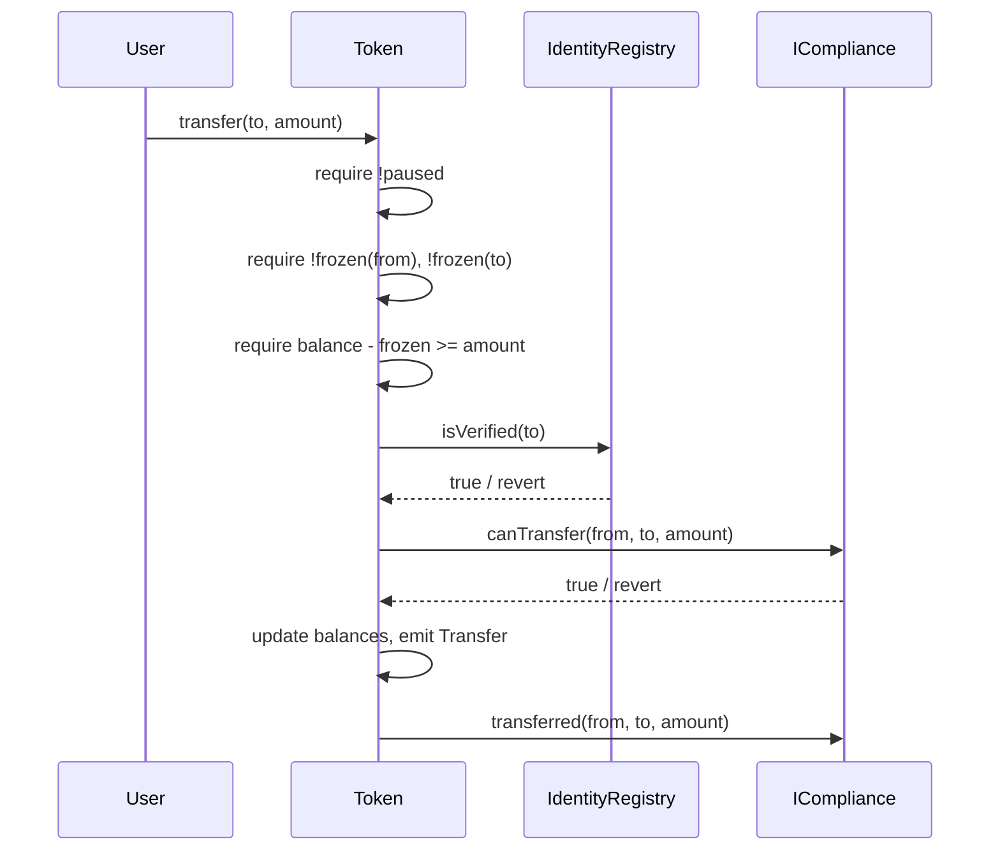

# Architecture

> **ERC-3643 Raptor** is a simplified, educational implementation of the [ERC-3643 (T-REX) permissioned token standard](https://eips.ethereum.org/EIPS/eip-3643) for onchain securities and Real World Asset (RWA) tokenization.

## Contracts at a glance

| Contract | Purpose | Inherits |
|---|---|---|
| `Token` | ERC-20 with transfer gating via compliance + identity checks | `IToken`, `AccessControl`, `Pausable` |
| `IdentityRegistry` | Binds wallet → ONCHAINID and checks KYC/AML claim verification | `IIdentityRegistry`, `AccessControl` |
| `IdentityRegistryStorage` | Shared identity storage; can be bound to multiple `IdentityRegistry` contracts | `IIdentityRegistryStorage`, `AccessControl` |
| `ClaimTopicsRegistry` | Required claim topic IDs (KYC=1, AML=2, …) | `IClaimTopicsRegistry`, `Ownable` |
| `ClaimIssuersRegistry` | Whitelist of authorized claim-issuer ONCHAINID contracts and the topics they can issue | `IClaimIssuersRegistry`, `Ownable` |
| `BasicCompliance` | Pass-through compliance — replace with a custom module implementing `ICompliance` for real rules | `ICompliance`, `AccessControl` |

## Transfer Flow

## Identity & claim verification (`IdentityRegistry.isVerified`)

1. Fetch the investor's ONCHAINID from `IdentityRegistryStorage`.
2. For each required claim topic in `ClaimTopicsRegistry`:
   - Get the list of authorized issuers for that topic from `ClaimIssuersRegistry`.
   - For each issuer, compute `claimId = keccak256(abi.encode(issuer, topic))` and read the claim from ONCHAINID.
   - Call `issuer.isClaimValid(identity, topic, sig, data)` — if any issuer returns `true`, the topic is satisfied.
3. If every required topic is satisfied, the investor is verified.

## Role matrix

| Role | Where | Capabilities |
|---|---|---|
| `DEFAULT_ADMIN_ROLE` (`0x00`) | `Token`, `IdentityRegistry`, `IdentityRegistryStorage`, `BasicCompliance` | Can grant/revoke all roles. Set on deployer. |
| `OWNER_ROLE` | `Token`, `IdentityRegistry`, `IdentityRegistryStorage` | Upgrade wiring: `setCompliance`, `setIdentityRegistry`, `setIdentityRegistryStorage`, `setClaimTopicsRegistry`, `setClaimIssuersRegistry`, `setOnchainID`, `bindIdentityRegistry`, `unbindIdentityRegistry` |
| `AGENT_ROLE` | `Token`, `IdentityRegistry`, `IdentityRegistryStorage` | Operational: `mint`, `burn`, `pause`, `unpause`, `forcedTransfer`, `setAddressFrozen`, `registerIdentity`, `updateIdentity`, `updateCountry`, `deleteIdentity`, `recoveryAddress` |
| `ADMIN_ROLE` | `BasicCompliance` | Bind/unbind tokens |
| `TOKEN_ROLE` | `BasicCompliance` | Granted to the bound `Token` — lets the token call back for unbind |
| `onlyOwner` | `ClaimTopicsRegistry`, `ClaimIssuersRegistry` | Add/remove topics and issuers |

## Threat boundary

User-facing entry points that are trust-critical:

- `Token.transfer` / `transferFrom` / `batchTransfer` — respect pause, frozen status, compliance, identity verification.
- `Token.mint` / `forcedTransfer` / `recoveryAddress` — `AGENT_ROLE`-gated, bypass pause.
- `Token.setCompliance` / `setIdentityRegistry` — `OWNER_ROLE`-gated, unbinds the old compliance before binding the new one.
- `IdentityRegistry.registerIdentity` — stores a wallet → ONCHAINID binding; if abused, an attacker could grant verification to their own wallet. `AGENT_ROLE` must be tightly held.

## Known simplifications vs. production T-REX

- **No proxies.** Raptor is non-upgradeable by design. A production token issuer should use Tokeny's upgradeable factory.
- **No DVD (Delivery-vs-Delivery).** Secondary-market atomic settlement is out of scope.
- **Pass-through compliance.** `BasicCompliance` returns `true` from `canTransfer`; build your own module per jurisdiction (country restrictions, transfer windows, max-holders, investor caps, etc.).
- **Simplified role management.** Uses OpenZeppelin `AccessControl` instead of the T-REX `AgentRole` / `OwnerRoles` contracts.
- **Immutable name/symbol/decimals.** No `setName` / `setSymbol` / `setDecimals`.

## Upgrade path to production

If you plan to deploy a real security token:

1. Use [Tokeny T-REX](https://github.com/TokenySolutions/T-REX) upgradeable contracts and factory.
2. Implement compliance modules for your regulatory regime (EU MiFID, US Reg D/S/CF, etc.).
3. Commission an audit (OpenZeppelin, Trail of Bits, ConsenSys Diligence, Certora).
4. Contact [Tokeny Solutions](https://tokeny.com/).

## References

- [EIP-3643 Specification](https://eips.ethereum.org/EIPS/eip-3643)
- [ERC-3643 Association](https://www.erc3643.org/)
- [Tokeny T-REX](https://github.com/TokenySolutions/T-REX)
- [ONCHAINID](https://github.com/onchain-id/solidity)
